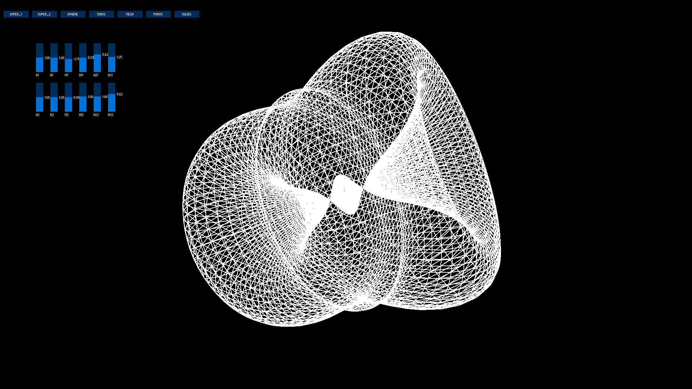

Topomorph is a Processing for Java sketch that creates 3D Supershapes using the Superformula created by Johan Gielis,
to provide an interactive intution of natural forms. GUI provides two sets of hideable sliders that control inputs to the variables
of the Superformula, and controls for 'Point', 'Mesh', and 'Solid' views. Projection to either a spherical or toroidal mapping
can also be selected. Inspired by the work of Paul Bourke.

Superformula in poler coords:

Sliders control input to each of these variables. There are two sets of sliders, one for the xy-plane, the other for the yz-plane.

Cartesian coords for Toroidal  mapping:

Cartesian coords for Spherical  mapping:

Range for theta and phi:

Examples:

